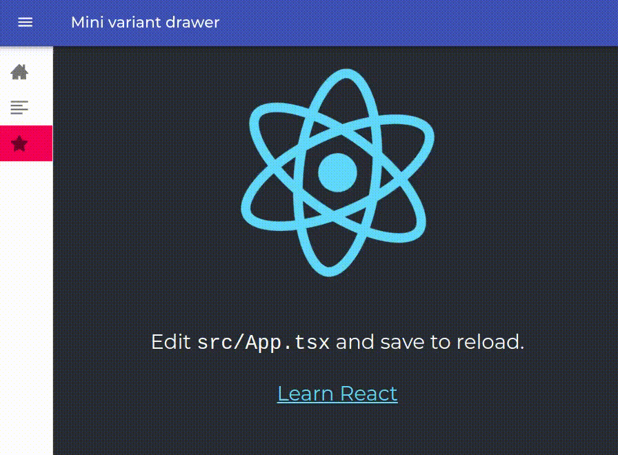
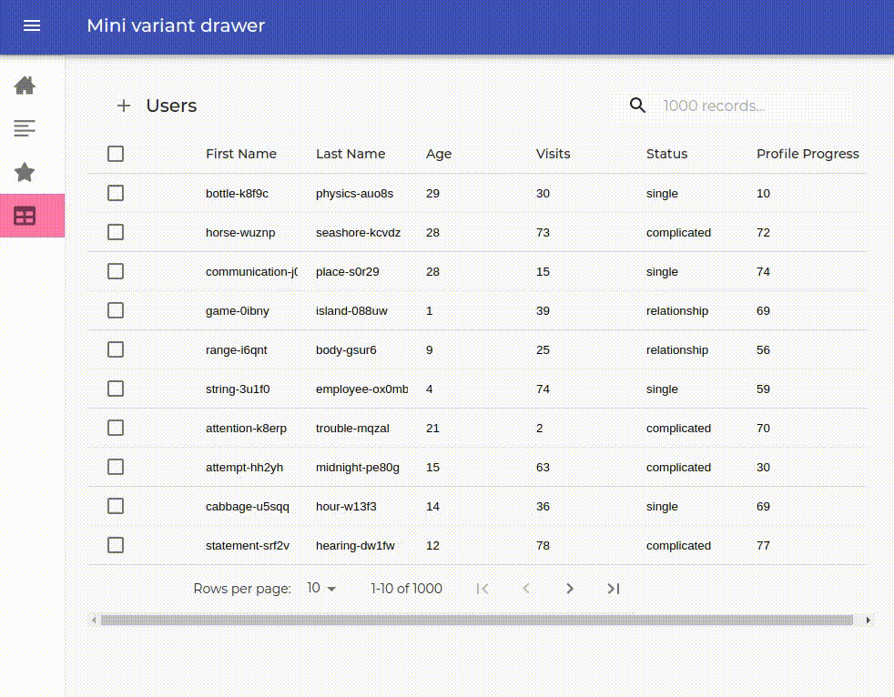

<h1 align="center">React starter with drawer menu and then some ⛵</h1>

  
  

### Description

When starting a new project, we generally use the same libraries and it's helpful to have some examples of that bunch of libraries in a working project.  
In the different sections of this React app you will find examples of use for these libraries you can look into before you integrate these libraries into your project.  
You can checkout different tags, each of them contains more utilities to fit the complexity of your needs. The tags are useful in the case you are only interested in the first basics examples. 
### Material mini drawer layout - tag 1.0 
  
Utilities included:
* [Material UI](https://material-ui.com) @material-ui/core
* [React router](https://reactrouter.com/web) react-router-dom
* [Styled components](https://styled-components.com) styled-components
* [React icons](https://react-icons.netlify.com) react-icons

### Table - tag 2.0 
  
Utilities included:
* [React Table](https://react-table-omega.vercel.app) react-table

### Instructions

1. Clone the repo and `cd` into  
`git clone https://github.com/s4nt14go/react-starter`  
1. (Optional) In the case you are want to checkout one of the intermediary tags you can do it with the following command, which also starts your own branch  
`git checkout tags/2.0 -b my-branch`  
You have to replace the tag number for the one you want.  
1. Install dependencies  
`npm i`  
1. Run the project  
`npm start`
