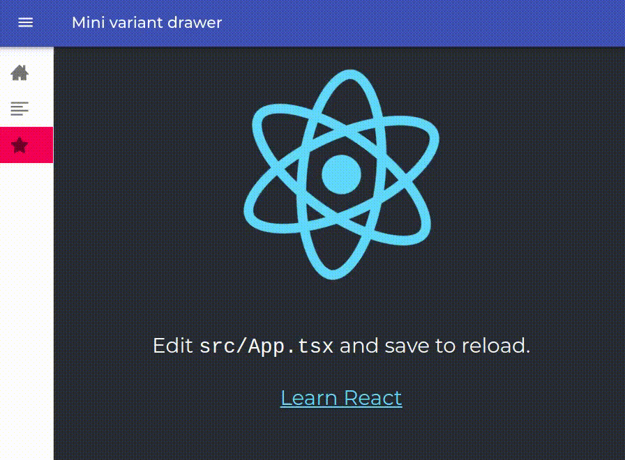
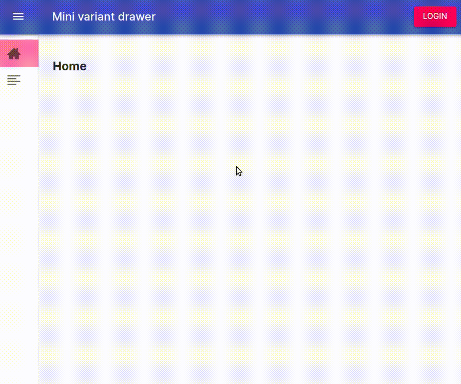

<h1 align="center">React starter with drawer menu and then some ⛵</h1>
<p>
  <a href="#" target="_blank">
    
  </a>
</p>

### Description

This starts from tag 1.0 of master branch and add authentication using Auth0.<br /><br />
✨ Click here to see the [final result](https://auth0--react-starter-s4nt14go.netlify.app)!<br /><br />
For the backend code which implements a custom authenticator for the API Gateway endpoint using Auth0 implement [this repo](https://github.com/s4nt14go/api-gateway-auth0), and follow [instructions down below](#auth0-authentication---head). 

In the case you would like to do the authentication using [AWS Cognito](https://aws.amazon.com/cognito) you can check [repo react-cognito](https://github.com/s4nt14go/react-cognito) 
### Material mini drawer layout - tag 1.0<br />
<br /><br />
Utilities included:
* [Material UI](https://material-ui.com) @material-ui/core
* [React router](https://reactrouter.com/web) react-router-dom
* [Styled components](https://styled-components.com) styled-components
* [React icons](https://react-icons.netlify.com) react-icons

### Landing page - tag 1.1<br />
<br /><br />
Utilities included:
* [Animate.css](https://animate.style) animate.css

### Auth0 authentication - HEAD<br />
As an example, we declared routes `/demo` and `/profile` as private, so they will be accessible only after login.<br /><br />
<br /><br />

Additionally, we add route `/api` that will call a backend endpoint protected with authentication<br />
<p align="center">
  
</p><br />

Dependencies added:
* [Auth0](https://auth0.com) @auth0/auth0-react
* [React syntax highlighter](https://github.com/react-syntax-highlighter/react-syntax-highlighter) react-syntax-highlighter

To reproduce this in your localhost you will have to configure it:

1. First create your backend by following the instructions in [this repo](https://github.com/s4nt14go/api-gateway-auth0).<br /><br />
1. In your Auth0 dashboard create a new Application and choose Single Page Web App type under the same tenant created for the backend. TIP: Generally, in Auth0 you create a tenant for every product you create, that way you can create multiple Applications (for example one for your mobile client an other for your web client) and APIs (for example to authenticate a service you may provide for your product) related to that specific product, so to keep things organized it may be convenient to create a tenant for this exercise, you can delete it afterwards.<br /><br />
1. When we login in our app we use an argument `redirectUri` to indicate to which path will be taken once Auth0 authenticates our user data, in the other hand, 
when we logout this is indicated with an argument `redirectTo`. In both cases we use `http://localhost:3000/home` so in your Auth0 dashboard in the Settings tab put into **Allowed Callback URLs**:<br />
 `http://localhost:3000, http://localhost:3000/home`<br />
 ...into **Allowed Logout URLs**:<br />
 `http://localhost:3000/home`<br />
 ...similarly into **Allowed Web Origins**:<br /> 
  `http://localhost:3000`<br />
  ...scroll to the end and click button Save Changes.<br /><br />
Of course, in the case you use an address different from `http://localhost:3000` to host your React app change accordingly.<br /><br />
1. Create a `.env.local` file inside the root folder (it is the same where `.gitignore` and `package.json` are located) and fill it like this:<br/>
    ```shell script
    REACT_APP_AUTH0_DOMAIN=<YOUR AUTH0 APP DATA>
    REACT_APP_AUTH0_CLIENTID=<YOUR AUTH0 APP DATA>
    REACT_APP_AUTH0_AUDIENCE=<YOUR AUTH0 API INDENTIFIER/AUDIENCE CREATED FOR BACKEND APP>
    REACT_APP_API_ENDPOINT=<YOUR AUTH0 API URL CREATED FOR BACKEND APP>
    ```
    TIP: Bear in mind that you need to restart your development server in the terminal in order to get the new environment variables loaded. This restart should be done every time you modify your `.env*` files.
   
## Installation instructions

Use same Node 14 version, using [nvm](https://github.com/nvm-sh/nvm) you can:

```
# set Node 14 in current terminal
nvm use 14
# set Node 14 as default (new terminals will use 14)
nvm alias default 14
```

Install:

```
npm ci
```

Run locally:

```
npm run start
```