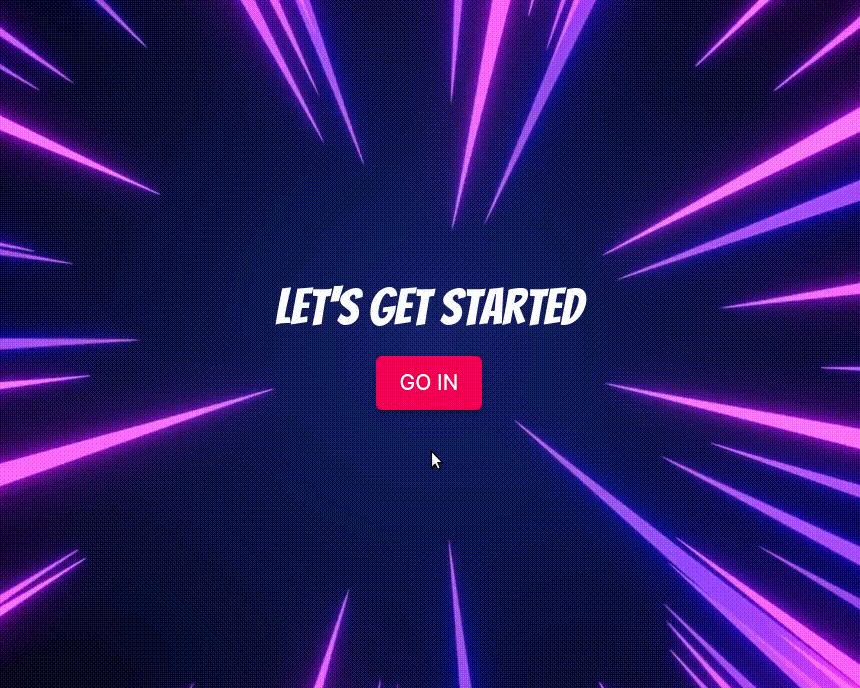
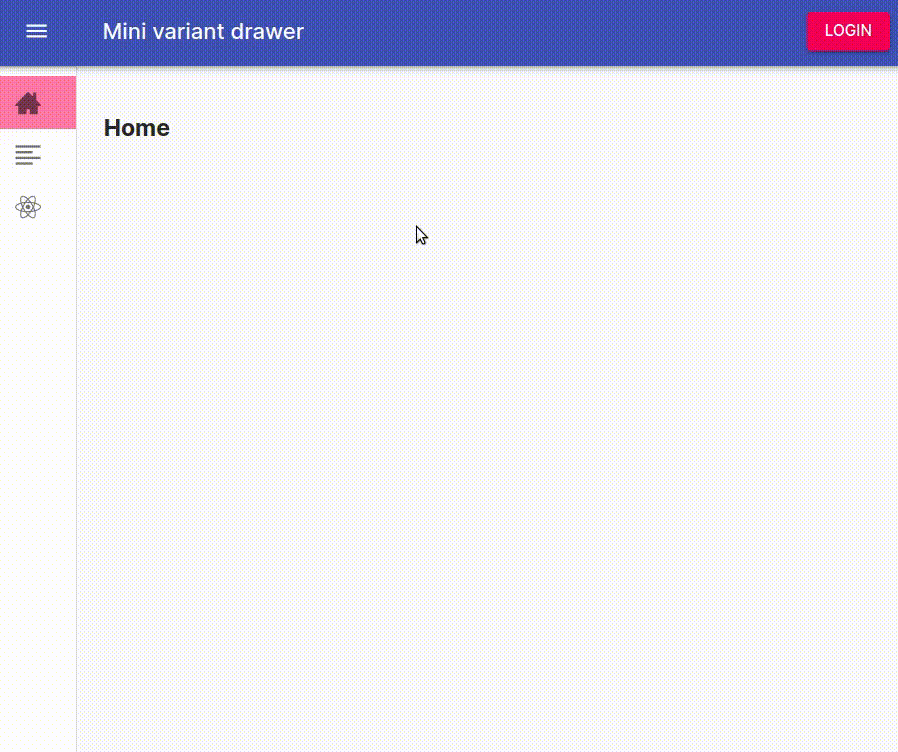

<h1 align="center">React starter with drawer menu and then some ⛵</h1>
<p>
  
  <a href="#" target="_blank">
    
  </a>
</p>

### Description

When starting a new project, we generally use the same libraries and it's helpful to have some examples of that bunch of libraries in a working project.<br /><br />
In the different sections of this React app you will find examples of use for these libraries you can look into before you integrate them into your project.<br /><br />
You can checkout different tags, each of them contains more utilities to fit your needs. The tags are useful in the case you are only interested in the first basics examples. 
### Material mini drawer layout - tag 1.0<br />
<br /><br />
Utilities included:
* [Material UI](https://material-ui.com) @material-ui/core
* [React router](https://reactrouter.com/web) react-router-dom
* [Styled components](https://styled-components.com) styled-components
* [React icons](https://react-icons.netlify.com) react-icons

### Landing page - tag 1.1<br />
<br /><br />
Utilities included:
* [Animate.css](https://animate.style) animate.css

### Auth0 authentication - tag 1.2<br />
<br /><br />
As an example, we declared the route with the react demo page as private, these are the utilities included:
* [Auth0](https://auth0.com) @auth0/auth0-react
* [React syntax highlighter](https://github.com/react-syntax-highlighter/react-syntax-highlighter) react-syntax-highlighter

To reproduce this in your localhost you will have to configure it:
1. Create your account in [Auth0](https://auth0.com)<br /><br />
1. In your Auth0 dashboard create a new Application and choose Single Page Web App type. TIP: Generally, in Auth0 you create a tenant for every product you create, that way you can create multiple Applications (for example one for your mobile client an other for your web client) and APIs (for example to authenticate a service you may provide for your product) related to that specific product, so to keep things organized it may be convenient to create a tenant for this exercise, you can delete it afterwards.<br /><br />
1. When we login in our app we use an argument `redirectUri` to indicate to which path will be taken once Auth0 authenticates our user data, in the other hand, 
when we logout this is indicated with an argument `redirectTo`. In both cases we use `http://localhost:3000/home` so in your Auth0 dashboard in the Settings tab put into **Allowed Callback URLs**:<br />
 `http://localhost:3000, http://localhost:3000/home`<br />
 ...into **Allowed Logout URLs**:<br />
 `http://localhost:3000/home`<br />
 ...similarly into **Allowed Web Origins**:<br /> 
  `http://localhost:3000`<br />
  ...scroll to the end and click button Save Changes.<br />
Of course, in the case you use an address different from `http://localhost:3000` to host your React app change accordingly.<br />  
Take note of the Domain and Client ID as you will use them next. Click on "Universal Login" in the side menu and select Experience type to New for an improved login page UI, scroll down and Save changes.<br /><br />
1. Create a `.env.local` file inside the root folder (it is the same where `.gitignore` and `package.json` are located) and copy there this:<br />
```shell script
REACT_APP_AUTH0_DOMAIN=<YOUR AUTH0 APP DATA>
REACT_APP_AUTH0_CLIENTID=<YOUR AUTH0 APP DATA>
```
TIP: Bear in mind that you need to restart your app in your terminal in order to get the new environment variables loaded.
